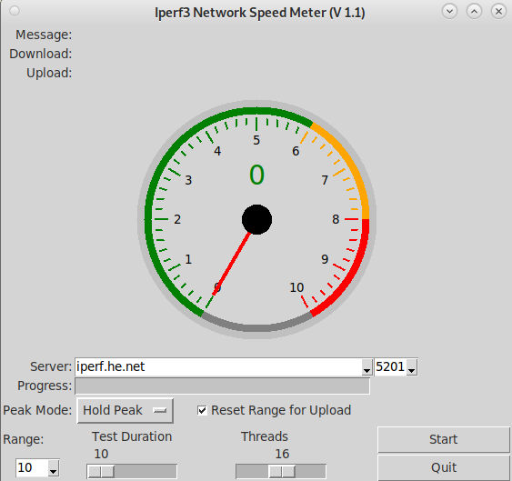

# Graphical User Interface for iperf3

                     

This is a graphical front end in python 3 for iperf3



## Introduction

This program has the following features:
* enter your own server ip/fqdn
* ports configurable (and presets)
* several (not all) options graphically configurable
* large gauge display
* auto ranging
* works on windows or linux
* gives download and upload speeds
* server and client mode supported

## Pre-Requisites

You need iperf3 installed. It can be downloaded from here: https://iperf.fr/iperf-download.php


## Install

Pre-requisite is an installation of python3.x

now clone the repository from GitHub (obviously you need `git` installed)
```bash
git clone https://github.com/onemarcfifty/iperf3-GUI.git
cd iperf3-GUI
```
You should now have the program `iperf.py` - make sure the file is executable

No need to install anything, you can just run the program as is.

run `./iperf.py -h` (or `python ./iperf.py -h` if you are on windows)

```
usage: iperf.py [-h] [-I IPERF_EXEC] [-ip [IP_ADDRESS ...]] [-p PORT] [-r RANGE] [-R] [-m {OFF,Track,Peak}]
                [-D] [-S] [-V] [-v]

Iperf3 GUI Network Speed Tester

optional arguments:
  -h, --help            show this help message and exit
  -I IPERF_EXEC, --iperf_exec IPERF_EXEC
                        location and name of iperf3 executable (default=iperf3)
  -ip [IP_ADDRESS ...], --ip_address [IP_ADDRESS ...]
                        default server address('s) can be a list (default=[])
  -p PORT, --port PORT  server port (default=5201)
  -r RANGE, --range RANGE
                        range to start with in Mbps (default=10)
  -R, --reset_range     Reset range to Default for Upload test (default = True)
  -m {OFF,Track,Peak}, --max_mode {OFF,Track,Peak}
                        Show Peak Mode (default = Peak)
  -D, --debug           debug mode
  -S, --server          run iperf in server mode
  -V, --verbose         print everything
  -v, --version         show program's version number and exit
```

You can now run iperf3 tests from the GUI